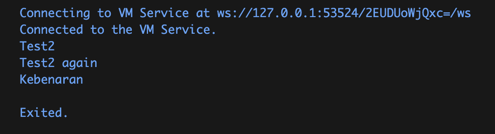

# Laporan Praktikum Pertemuan 3

**Mata Kuliah:** Pemrograman Mobile
**Nama:** Rifqi Hilmi Mubarok
**NIM:** 244107060110

---

## Praktikum 1: Menerapkan Control Flows ("if/else")

### Langkah 2:
**Apa yang terjadi? Jelaskan!**

Jika kode pada Langkah 1 dieksekusi, akan **terjadi error syntax**. Hal ini terjadi karena bahasa Dart bersifat *case-sensitive* (membedakan huruf besar dan huruf kecil). Pada kode tersebut, penulisan kata kunci (keyword) conditional menggunakan huruf kapital yaitu `else If` dan `Else`, yang tidak dikenali oleh compiler Dart. 

**Perbaikan:** 
Keyword tersebut harus diganti menjadi huruf kecil semua yaitu `else if` dan `else`.

### Langkah 3:
**Apa yang terjadi ? Jika terjadi error, silakan perbaiki namun tetap menggunakan if/else.**

Jika kode dijalankan, maka akan **terjadi error**. Hal ini terjadi karena Dart adalah bahasa yang *strongly typed*. Pada statement `if`, kondisi pembanding wajib bernilai **boolean** (`true` atau `false`). Sedangkan pada kode yang diberikan, variabel `test` bertipe **String** (`"true"`), sehingga tidak bisa langsung diberikan dalam kondisi `if(test)`.

**Perbaikan:** 
Untuk memperbaikinya agar tetap memakai struktur `if/else`, kita bisa membandingkan nilai String-nya menggunakan operator persamaan:

```dart
String test2 = "true";
if (test2 == "true") {
   print("Kebenaran");
}
```
hasil pengerjaan:


---

## Praktikum 2: Menerapkan Perulangan "while" dan "do-while"

### Langkah 2:
**Apa yang terjadi? Jelaskan! Lalu perbaiki jika terjadi error.**

Jika kode dijalankan, akan **terjadi error** `Undefined name 'counter'`. Hal ini karena variabel `counter` belum dideklarasikan dan diinisialisasi nilai awalnya sebelum digunakan dalam perulangan `while`.

**Perbaikan:**
Kita harus mendeklarasikan variabel `counter` (misalnya dengan tipe integer dan nilai awal 0) sebelum statement `while` dieksekusi.

```dart
int counter = 0; // Menambahkan deklarasi dan inisialisasi variabel
while (counter < 33) {
  print(counter);
  counter++;
}
```

### Langkah 3:
**Apa yang terjadi ? Jika terjadi error, silakan perbaiki namun tetap menggunakan do-while.**

Jika kode dilanjutkan dari Langkah 2 sebelumnya, **tidak akan terjadi error** dan program akan berjalan dengan normal. Variabel `counter` yang pada akhir eksekusi `while` (langkah 2) bernilai 33, akan langsung dicetak dan ditambah 1 secara terus-menerus melalui perulangan `do-while` hingga angka 76, lalu berhenti karena kondisi `counter < 77` sudah tidak terpenuhi bernilai true.

*(Catatan: Jika langkah 3 dijalankan terpisah dari langkah 2, maka akan terjadi error undeclared variable yang sama. Solusinya adalah dengan menambahkan inisialisasi `int counter = 33;` di atas statement do-while)*

```dart
do {
  print(counter);
  counter++;
} while (counter < 77);
```

---

## Praktikum 3: Menerapkan Perulangan "for" dan "break-continue"

### Langkah 2:
**Apa yang terjadi? Jelaskan! Lalu perbaiki jika terjadi error.**

Jika kode dijalankan, akan **terjadi error** karena beberapa kesalahan sintaks dan penulisan berikut:
1. Tidak mendeklarasikan tipe data (seperti `int`) saat inisialisasi variabel.
2. Kesalahan *case-sensitive*, di mana ada penggunaan huruf kapital pada `Index`, namun kemudian menggunakan huruf kecil `index` di dalam statement loop sehingga dianggap sebagai variabel berbeda.
3. Pada bagian *update statement* dari perulangan `for`, hanya tertulis `index` (tanpa operasi apapun). Seharusnya diberi operasi increment seperti `index++`. Bila dipaksa jalan pun akan mengakibatkan program terjebak *infinite loop* (perulangan tanpa henti).

**Perbaikan:**
```dart
for (int index = 10; index < 27; index++) {
  print(index);
}
```

### Langkah 3:
**Apa yang terjadi ? Jika terjadi error, silakan perbaiki namun tetap menggunakan for dan break-continue.**

Sama seperti kesalahan sebelumnya, kode ini akan menyebabkan **terjadi error syntax** karena sifat *case-sensitive* dari bahasa Dart:
1. Penulisan statement kondisional menggunakan huruf awalan kapital `If` dan `Else If`, seharusnya huruf kecil `if` dan `else if`.
2. Penggunaan huruf awal kapital pada pengecekan variabel `(Index == 21)` dan di baris pertama deklarasinya memicu status "Undefined Name", seharusnya konsisten memakai `index`.

**Perbaikan:**
```dart
for (int index = 10; index < 27; index++) {
  if (index == 21) break;
  else if (index > 1 || index < 7) continue;
  print(index);
}
```

*(Catatan hasil eksekusi: Secara logika, saat kode jalankan **tidak akan ada output teks (angka) apapun yang dicetak ke layar**. Hal ini karena iterasi angka `index` dimulai dari `10`. Mengingat angka 10 dst itu jauh lebih besar dari angka 1, kondisi di percabangan `(index > 1 || index < 7)` akan menjadi **selalu terpenuhi (true)**. Hal ini memicu command `continue` membatalkan/ngeskip print() yang berada di bawahnya lalu menaikkannya ke iterasi yang baru dari rentang angka 10 sampai angka berhenti menjadi 21 karena di-`break`... Pada perulangan ini, metode print "terlewarkan" terus menerus.)*

---

## Tugas Praktikum

Pada tugas praktikum ini, saya membuat program Dart yang bertugas untuk menampilkan bilangan prima dari rentang angka 0 hingga 201. Sesuai instruksi, secara beriringan program juga akan menampilkan Nama Lengkap dan NIM setiap kali bilangan prima tersebut ditemukan.

**Kode Program (`tugas_praktikum.dart`):**
```dart
void main() {
  String nama = "Rifqi Hilmi Mubarok";
  String nim = "244107060110";

  print("=== Program Bilangan Prima (0 - 201) ===");

  for (int i = 0; i <= 201; i++) {
    if (isPrime(i)) {
      print("Bilangan Prima: $i");
      print("Nama: $nama");
      print("NIM : $nim");
      print("-------------------------------");
    }
  }
}

bool isPrime(int number) {
  if (number < 2) return false;
  
  for (int i = 2; i <= number ~/ 2; i++) {
    if (number % i == 0) {
      return false;
    }
  }
  
  return true;
}
```

**Penjelasan Alur Program:**
1. Program mulai berjalan dari fungsi `main()`, di mana inisiasi variabel `nama` dan `nim` dilakukan terlebih dahulu.
2. Digunakan perulangan `for` untuk melakukan iterasi nilai dari `0` hingga `201` pada variabel `i`.
3. Pada setiap angka yang sedang diproses, angka tersebut dilemparkan ke dalam fungsi buatan yang bernama `isPrime(i)` yang akan mengevaluasi apakah ia sebuah bilangan prima atau bukan.
4. Di dalam fungsi `isPrime()`, jika angka `< 2` maka langsung divonis bukan bilangan prima. Kemudian, program menggunakan loop mulai angka `2` hingga setengah dari nilai yang dievaluasi (`number ~/ 2`) untuk mengecek apakah `number` habis dibagi dengan salah satu angka di rentang iterasi tersebut. Jika **habis dibagi (`% == 0`)**, maka angka tersebut juga vonis bilangan komposit/bukan prima dan *return* membalikkan `false`. Jika tidak ada yang bersisa `0`, maka bernilai **sebagai bilangan prima**, *return* dikembalikan `true`.
5. Apabila output dari fungsi `isPrime()` bernilai **true**, maka statement `if (isPrime(i))` di dalam *loop* utama akan dijalankan, yang mana akan menampilkan angka bilangannya (`i`), Nama `Rifqi Hilmi Mubarok`, dan NIM `244107060110` secara bersama-sama di layar terminal.

Untuk mengumpulkannya di GitHub, Anda bisa melakukan *commit* isi folder yang sudah dikerjakan ini (`README.md` yang telah direvisi dan diisikan *screenshot* dari hasil running Anda sendiri, beserta file-file `.dart`).
